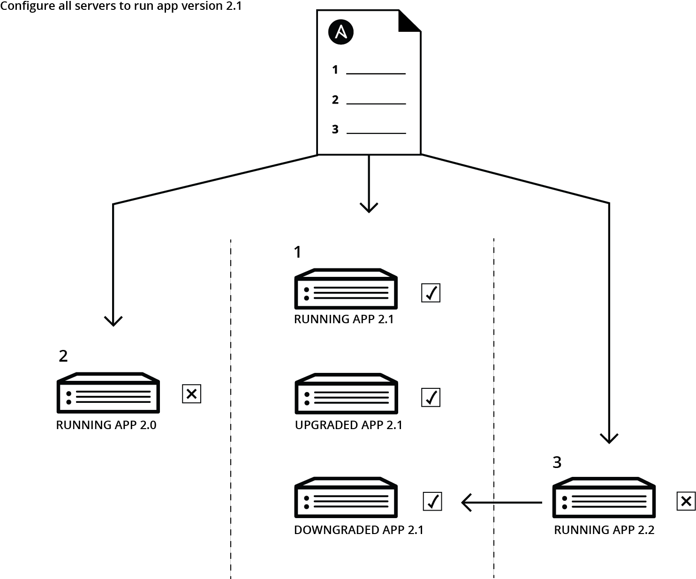

### [◀](/SOSC-2018)

Before starting download the hands-on repository and move inside the directory as follow:

```bash
git clone https://github.com/DODAS-TS/SOSC-2018.git
cd SOSC-2018
```

# Automation with Ansible

## What's Ansible

[](https://dodas-ts.github.io/SOSC-2018/img/ansible.webp)

[Ansible](https://www.ansible.com) is a software that consistently automatize the configuration management. The Ansible configurations are a set of minimal infrastracture descriptions that are easy to read and to mantain, reducing the amount of work needed to setup environment and softwares on data centers or even on a laptop.
Ansible does not require any remote agents and delivers all modules to remote systems that execute tasks, as needed, to deploy the desired configuration.
[Ansible Galaxy](https://galaxy.ansible.com/) also has over 4,000 community-provided roles that can be used by anyone and tailored to different environments.

__In this hands-on we are going to deploy a simple web server application as a first introduction to Ansible recipes.__

## Hello word: install and deploy a webserver with Ansible

### Playbooks

Playbooks are the Ansible building blocks. They describes the desired infrastracture with a sequence of states and checks, that will be automatically deployed at installation time. Ansible infact implements a "state-driven" paradigm, that does not indicate the exact chain of commands but instead check a sequential list of machine state. But let's do an exercise to understand better the basics.

- install the apache2 packages on localhost

``` yaml
---
- hosts: localhost
  connection: local
  tasks:
  - name: Apache | Make sure the Apache packages are installed
    apt: name=apache2 update_cache=yes
    when: ansible_os_family == "Debian"

  - name: Apache | Make sure the Apache packages are installed
    yum: name=httpd
    when: ansible_os_family == "RedHat"
```

- start services after configuration customization

``` yaml
---
- hosts: localhost
  connection: local
  tasks:
  - name: Configure apache 1/2
    get_url:
      force: true
      url: https://raw.githubusercontent.com/DODAS-TS/SOSC-2018/master/templates/hands-on-1/apache-config/port.conf
      dest: /etc/apache2/ports.conf
  
  - name: Configure apache 2/2
    get_url:
      force: true
      url: https://raw.githubusercontent.com/DODAS-TS/SOSC-2018/master/templates/hands-on-1/apache-config/000-default.conf
      dest: /etc/apache2/sites-enabled/000-default.conf

  - name: Start Apache service
    service: name=apache2 state=restarted
    when: ansible_os_family == "Debian"

  - name: Start Apache service
    service: name=httpd state=restarted
    when: ansible_os_family == "RedHat"
```

### Run the playbooks

- install the apache2 packages on localhost

``` bash
ansible-playbook templates/hands-on-1/ansible-role-install.yml
```

- start services after configuration customization

``` bash
ansible-playbook templates/hands-on-1/ansible-role-apache.yaml
```

- the apache default webpage should now being served at `localhost:4880`

__N.B. with this simple configuration files we will be able to reproduce with a single command the current state on different machines. Of course this is a very simple software installation that is meant as demonstrator, but in principle can be much more complicated.__